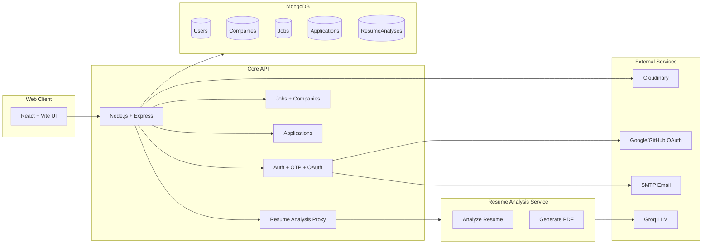
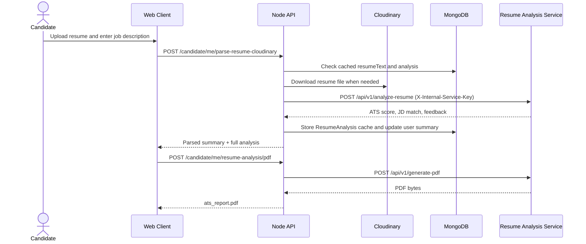
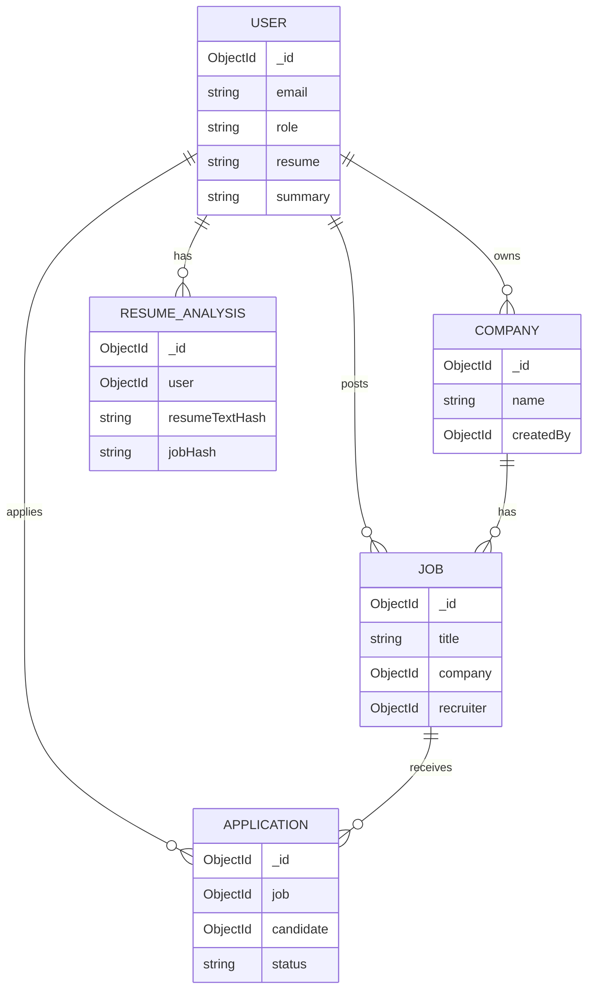

# JobCortex

JobCortex is a full-stack job portal with AI-assisted resume analysis and recruiter shortlisting. It connects candidates and recruiters, automates resume parsing and ATS scoring, and provides job-fit signals to speed up hiring decisions.

## Why it exists
Manual screening and unstructured resumes slow down hiring. JobCortex standardizes resume data, surfaces skill gaps against job descriptions, and helps recruiters rank applicants consistently.

## Key features

### Candidate features
- Email + OTP signup and login, plus Google and GitHub OAuth.
- Profile builder for skills, experience, education, projects, and certifications.
- Resume upload and replacement (PDF, DOC, DOCX) stored in Cloudinary.
- Job discovery with search and detail pages.
- Apply, withdraw, and track application status.
- AI resume analysis with ATS score, JD match, skills gap, and summary.
- Export analysis as a PDF report.

### Recruiter features
- Company profile creation and updates.
- Post jobs, update listings, and toggle active or inactive status.
- Manage applications and update statuses.
- AI shortlist that combines skills-match scoring with resume-fit scoring.
- Candidate discovery (applied candidates list and skill-based search).

### Platform features
- Role-based access control for candidate and recruiter.
- Internal service authentication between API and analysis service.
- Background consistency job to remove orphaned applications.
- Structured logging and safe error handling.

## Microservice architecture

Runtime services are split into three parts: the web client, the core API, and a dedicated resume analysis service. The repository also includes a standalone ATS scorer app for experimentation.



## API calling use case: resume analysis and PDF export



## Database model (high level)



## Directory structure

```
JobCortex/
├── client/                       React UI (Vite)
│   ├── src/
│   │   ├── api/                   API wrappers (axios)
│   │   ├── components/            UI components
│   │   ├── pages/                 Candidate and recruiter pages
│   │   └── context/               Auth and app state
├── server/                       Core API (Node.js + Express + MongoDB)
│   ├── ai/                        Resume analysis adapters
│   ├── config/                    DB and Cloudinary setup
│   ├── controllers/               Request handlers
│   ├── middlewares/               Auth and role guards
│   ├── models/                    Mongoose schemas
│   ├── routes/                    REST endpoints
│   ├── services/                  Background jobs and integrations
│   └── utils/                     Parsing and helpers
├── resume-analysis-service/       FastAPI resume analysis microservice
│   └── backend/                   API, NLP pipeline, report generation
├── ai-resume-ats/                 Standalone ATS scorer (FastAPI + Streamlit)
├── db-backup/                     MongoDB dump (optional)
└── README.md
```

## Tech stack

### Frontend
- React 19, Vite 7
- Tailwind CSS 4, Radix UI, shadcn/ui
- React Router, React Hook Form, Zod
- Axios, Framer Motion

### Core API
- Node.js, Express 5
- MongoDB with Mongoose
- Passport (Google/GitHub OAuth), JWT + HttpOnly cookies
- Cloudinary, Multer, pdf-parse, mammoth
- Winston logging, Nodemailer

### Resume analysis service
- FastAPI, Pydantic, Uvicorn
- spaCy, Sentence Transformers, RapidFuzz
- PDF/DOCX parsing utilities
- Groq API for LLM suggestions
- Playwright for PDF export

### Standalone ATS scorer (ai-resume-ats)
- FastAPI + Streamlit
- spaCy, Sentence Transformers
- Supabase auth + storage

## Environment variables

### server/.env
```
MONGODB_URI=mongodb://localhost:27017/jobcortex
DB_NAME=jobcortex
PORT=5000
NODE_ENV=development

CLIENT_URL=http://localhost:5173
JWT_SECRET=your_jwt_secret_key
JWT_REFRESH_SECRET=your_refresh_secret
JWT_EXPIRES_IN=7d

EMAIL_HOST=smtp.gmail.com
EMAIL_PORT=587
EMAIL_USER=your_email@gmail.com
EMAIL_PASS=your_email_password

GOOGLE_CLIENT_ID=your_google_client_id
GOOGLE_CLIENT_SECRET=your_google_client_secret
GOOGLE_CALLBACK_URL=http://localhost:5000/auth/google/callback
GITHUB_CLIENT_ID=your_github_client_id
GITHUB_CLIENT_SECRET=your_github_client_secret
GITHUB_CALLBACK_URL=http://localhost:5000/auth/github/callback

CLOUDINARY_CLOUD_NAME=your_cloudinary_cloud_name
CLOUDINARY_API_KEY=your_cloudinary_api_key
CLOUDINARY_API_SECRET=your_cloudinary_api_secret

RESUME_ANALYSIS_SERVICE_URL=http://localhost:8001
RESUME_ANALYSIS_SERVICE_KEY=your_internal_service_key
GEMINI_API_KEY=your_gemini_api_key

SESSION_SECRET=your_session_secret_key

# Optional controls
RESUME_MAX_SIZE_MB=5
PROFILE_IMAGE_MAX_SIZE_MB=2
CONSISTENCY_JOB_INTERVAL_HOURS=24
```

### client/.env
```
VITE_API_BASE_URL=http://localhost:5000
```

### resume-analysis-service/.env
```
INTERNAL_SERVICE_KEY=your_internal_service_key
GROQ_API_KEY=your_groq_api_key
SENTENCE_TRANSFORMER_MODEL=all-MiniLM-L6-v2
```

## Local setup

### 1) Core API
```
cd server
npm install
npm run server
```

### 2) Resume analysis service
```
cd resume-analysis-service
python -m venv .venv
# Windows (PowerShell)
.\.venv\Scripts\Activate
# macOS/Linux
source .venv/bin/activate
pip install -r backend/requirements.txt
python -m spacy download en_core_web_md
python -m playwright install
uvicorn backend.main:app --reload --host 0.0.0.0 --port 8001
```

### 3) Web client
```
cd client
npm install
npm run dev
```

Open the app at http://localhost:5173

## API surface (selected)

### Auth
- POST /auth/signup, /auth/login, /auth/verify-otp
- GET /auth/google, /auth/github
- GET /auth/me, PATCH /auth/update-role

### Candidate
- GET /candidate/jobs, /candidate/jobs/:jobId
- POST /candidate/jobs/:jobId/apply
- GET /candidate/applications/me
- POST /candidate/me/resume
- POST /candidate/me/parse-resume-cloudinary
- POST /candidate/me/resume-analysis/pdf

### Recruiter
- POST /company/profile, GET /company/me, PUT /company/me
- POST /jobs, GET /jobs/my, PUT /jobs/:jobId, DELETE /jobs/:jobId
- GET /recruiter/applications/:jobId
- GET /recruiter/applications/:jobId/ai-shortlisted
- GET /recruiter/candidates/applied, /recruiter/candidates/search

## Database and backups

- MongoDB database name: jobcortex
- Backup dump: db-backup/jobportal
- Collections: Users, Companies, Jobs, Applications, ResumeAnalyses

## Notes

- The resume analysis service is stateless; caching is stored in MongoDB by the core API.
- Internal service calls require X-Internal-Service-Key.
- For job-fit scoring, candidates must have parsed resumes stored in their profile.